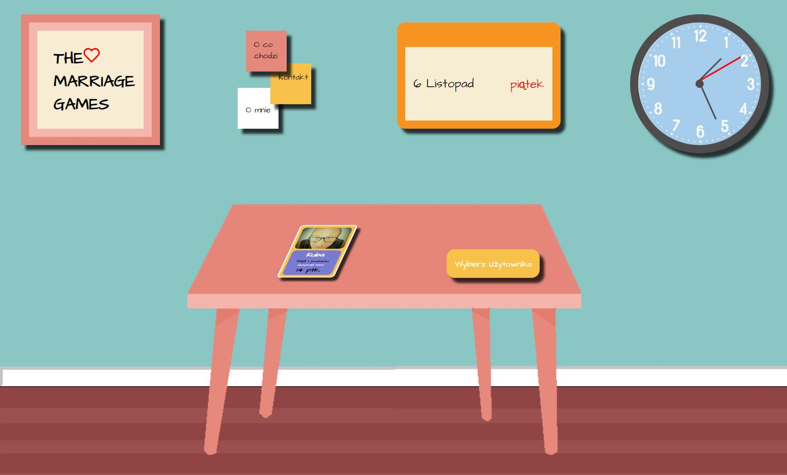
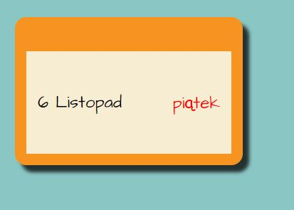
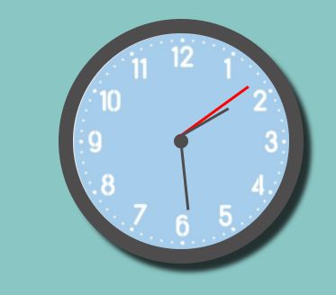
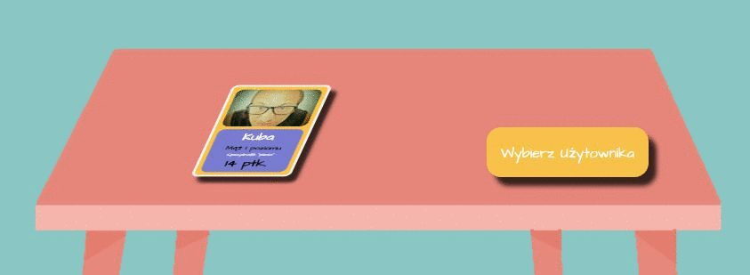
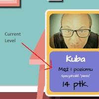
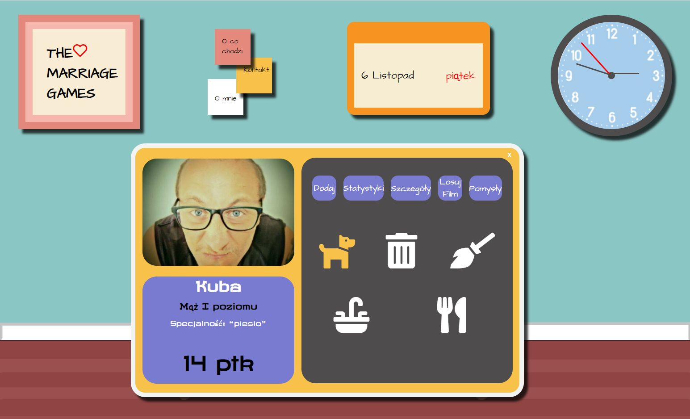

#The Marriage Games - My first React App

The Marriage Games is my first App created with React.
I used React.js and SCSS to create it.
At the moment app ,is designed for me and my wife, by using it  we can check who is better partner;)

On top, you can see menu with logo, notes, calendar and clock.

In notes, it is possible to check some information about project and about myself.
.gif)

Calendar shows actaul date.

Clock shows actual time, its created by SCSS and React.

Main page of app is in the center and contains cards with users. 

In user card You can see Name.
Level is changing depnds on how much points you have.
Speciality is changing depnds on individual points.
Points shows your current points level
.

In user page it possible to add points with designed buttons.
.

In Statistic Menu App is compering points of both User.
.gif).
